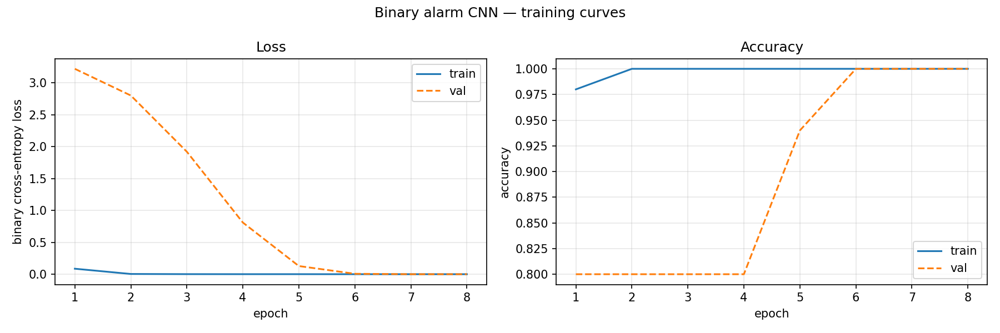
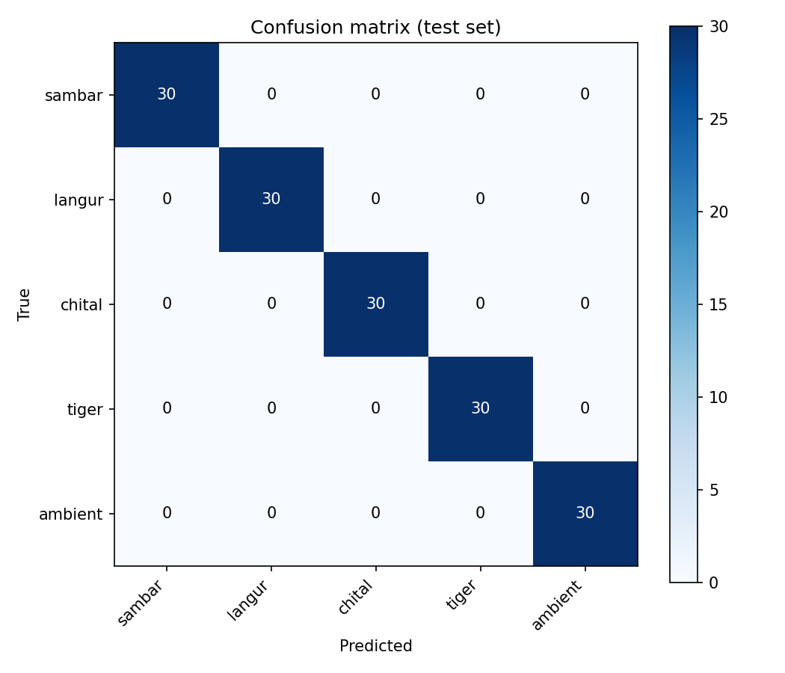
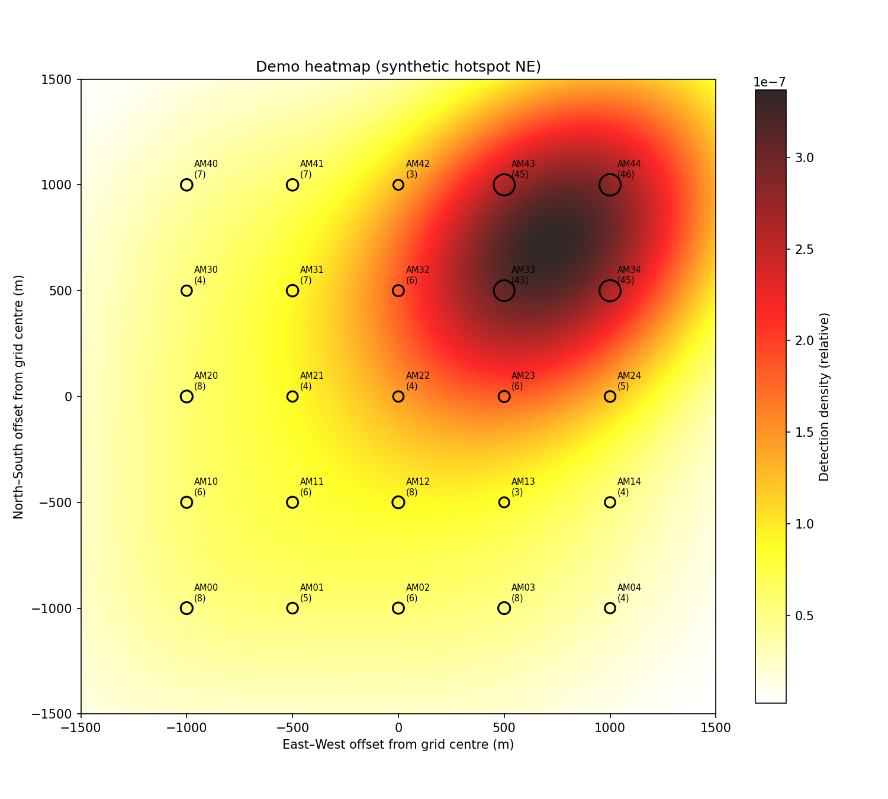
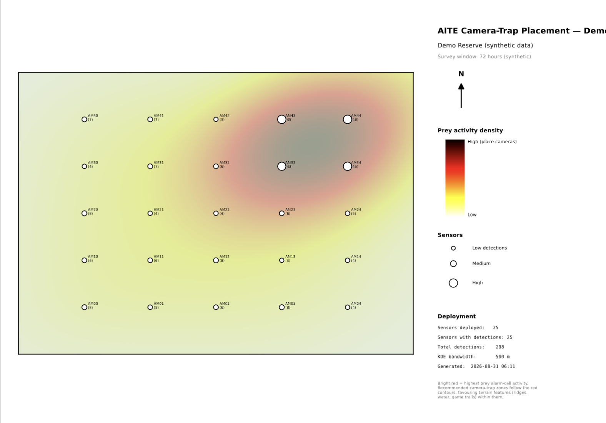
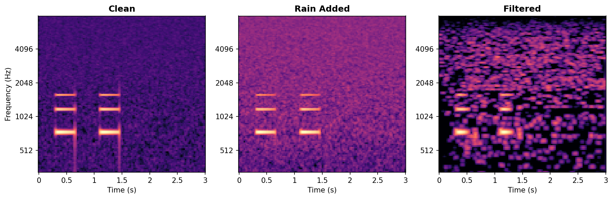
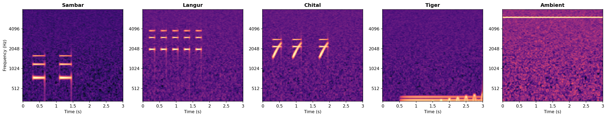

# Tiger Acoustic Pre-Screening System

**Prey alarm-call detection for camera-trap placement optimization during India's All India Tiger Estimation (AITE).**

An offline machine-learning pipeline that analyses AudioMoth recordings from a sensor grid, detects sambar/langur/chital alarm calls (and tiger vocalizations as rare-event alerts), and generates ranger-ready heatmap PDFs showing where prey activity concentrated over the survey window.

---

## What this actually does

```
   AudioMoth WAV recordings (72-hour deployments)
              │
              ▼  audio_loader · noise_filter · spectrogram
    mel spectrograms (128 mel bands, 200–8000 Hz)
              │
              ▼  binary CNN  or  multi-class CNN
    per-window class probabilities
              │
              ▼  sliding window (3s, 50% overlap) + detection merging
    timestamped detection list (CSV)
              │
              ▼  aggregate per sensor → weighted KDE
    2D prey-activity density surface
              │
              ▼  overlay on satellite image + legend + metadata
    ranger-ready A3 PDF (camera-trap placement guide)
```

Each arrow is an independently testable module. The pipeline runs entirely offline — no internet required at deployment sites — which is a hard constraint for actual tiger reserves in central and eastern India.

---

## Why this exists

India runs the **All India Tiger Estimation** every four years across all 55 tiger reserves. A major cost centre is camera-trap placement: ~26,000 cameras placed and retrieved across the country, with placement traditionally guided by prior sightings, terrain, and ranger intuition. Better-placed cameras capture more tigers per camera-day, cost less overall, and reduce the number of survey personnel-hours needed.

Prey alarm calls are a well-established acoustic indicator of predator (tiger, leopard) presence — sambar "dhank", langur "khok-khok", and chital sharp alarm barks all signal an actively hunted area. This project uses that signal to help rangers place cameras where prey activity — and by proxy, predator activity — was highest during a pre-survey acoustic sweep.

## Prior work this builds on

- **Kershenbaum et al. (2026)** — proof that a small CNN can reliably detect chital alarm calls in field conditions; deployed on TinyML hardware in Nepal's Terai. Their labelled dataset is not public, so I could not fine-tune from it; this project uses synthetic data for pipeline validation with a clear path to real-data ingestion.
- **MARVEL (Maharashtra government SPV)** — an operational bio-acoustic system deployed in March 2026 across the Nagpur rural belt near Pench Tiger Reserve. MARVEL detects prey alarm calls and triggers real-time village-safety sirens. The technology stack is closed and the training dataset is not shared. This project differs in purpose: MARVEL is a real-time community-alert system; this is an offline batch-processing tool for census planning.
- **AudioMoth (Open Acoustic Devices)** — the low-cost open-hardware recorder that made grid-scale acoustic monitoring economically feasible.

The differentiator is not the acoustic front-end (which is well understood) but the specific downstream use: producing georeferenced camera-trap placement heatmaps as a first-class deliverable for the AITE workflow.

---

## Results (on synthetic data)

### Binary classifier — alarm vs ambient

- **Test accuracy: 100%** on 150-sample held-out synthetic test set
- Precision: 100%, Recall: 100%
- Trained in ~3 minutes on an Intel MacBook (CPU only)



### Multi-class classifier — 5-way species ID

- **Test accuracy: 100%** across sambar / langur / chital / tiger / ambient
- Confusion matrix clean diagonal on synthetic data



### Sliding-window inference — long recording

Planted synthetic sambar call at t=8s and langur call at t=20s in a 30-second test recording:

```
Detection(6.0–12.0s, sambar/chital*, conf=0.99)
Detection(18.0–24.0s, langur, conf=1.00)
```

_minor species confusion — see limitations_

### Heatmap generation

25-sensor 5×5 grid at 500m spacing with a synthetic activity hotspot in the NE quadrant:



### Ranger-ready PDF

A3 landscape with heatmap overlay, sensor markers sized by detection count, legend, north arrow, deployment metadata:



### Preprocessing visualizations

Comparison of raw vs filtered audio and mel spectrograms of each species' distinctive signature:




---

## Reproducibility

Every result above can be reproduced end-to-end from a fresh clone in under 30 minutes on a modern laptop (CPU only, no GPU required).

### Setup

Requires Python 3.9+ on macOS or Linux.

```bash
git clone https://github.com/Eccentric1208/tiger-acoustic-prescreening.git
cd tiger-acoustic-prescreening
python3 -m venv venv
source venv/bin/activate
pip install -r requirements.txt
```

### Run the full pipeline

```bash
# 1. Generate synthetic training data (1000 clips across 5 classes)
python src/utils/generate_samples.py

# 2. Train the binary classifier (~3 minutes on CPU)
python -m src.model.train_binary

# 3. Train the multi-class classifier (~7 minutes on CPU)
python -m src.model.train_multiclass

# 4. Run sliding-window inference on a synthetic 30s recording
python -m src.inference.sliding_window

# 5. Generate a demo heatmap from a synthetic 25-sensor grid
python -m src.mapping.heatmap

# 6. Export the ranger-ready PDF
python -m src.mapping.pdf_export
```

Outputs land in `results/`:

- `results/models/` — trained model files (`.keras`)
- `results/plots/` — training curves, confusion matrices, heatmaps
- `results/plots/ranger_map_demo.pdf` — the ranger-facing deliverable

---

## Project structure

```
tiger-acoustic-prescreening/
├── src/
│   ├── preprocessing/
│   │   ├── audio_loader.py       # WAV loading, resampling, normalization
│   │   ├── noise_filter.py       # Bandpass, spectral subtraction, energy gate
│   │   ├── spectrogram.py        # Mel spectrogram (128 bands, 200–8000 Hz)
│   │   └── dataset.py            # Stratified tf.data pipeline
│   ├── model/
│   │   ├── binary_cnn.py         # Alarm vs ambient (~100K params)
│   │   ├── multiclass_cnn.py     # 5-way species classifier
│   │   ├── train_binary.py       # Binary training + evaluation
│   │   └── train_multiclass.py   # Multi-class training + evaluation
│   ├── inference/
│   │   └── sliding_window.py     # Long-recording inference + merging
│   ├── mapping/
│   │   ├── heatmap.py            # Weighted KDE from sensor grid
│   │   └── pdf_export.py         # A3 ranger PDF with satellite overlay
│   └── utils/
│       └── generate_samples.py   # Synthetic training data
├── data/
│   ├── raw/                      # Audio (gitignored; regenerated locally)
│   └── DATA_SOURCES.md           # Notes on real-data sources
├── results/                      # Outputs (gitignored)
├── requirements.txt
├── LICENSE
└── README.md
```

---

## Limitations

Being upfront about what this system is and isn't:

**Data.** The 100% accuracy figures above are on synthetic audio generated to match published frequency profiles of the target species. Real xeno-canto and field recordings will introduce microphone variability, distance attenuation, wind, rain, overlapping calls, and species-specific texture that the synthetic generator does not model. Expected real-world accuracy will be materially lower until the model is fine-tuned on actual labelled recordings. The pipeline is deliberately built to make that swap trivial (`dataset.py` needs only a new folder pointed at real WAVs).

**Field validation.** No AudioMoth grid deployment has been run. Sensor placement, weatherproofing, SD card management, and end-to-end operational workflow have been designed but not tested in a real reserve.

**Species-level confusion.** In sliding-window inference on synthetic overlapping frames, the multi-class model occasionally confuses sambar and chital (their frequency ranges partially overlap). The binary alarm-vs-ambient result is more robust and is arguably the more useful output for camera-trap placement, which cares about "was there activity" more than "which species called."

**Not a real-time alert system.** This is a batch-processing tool designed for offline analysis of completed 72-hour recordings. For real-time village-safety alerts, see MARVEL — different problem, different architecture.

**Deployment infrastructure not yet built.** Ingestion from SD cards, batch processing across multiple sensor grids, and a non-CLI operator interface remain as future work.

---

## Roadmap

**Short term (real-data validation)**

- Scrape xeno-canto and iNaturalist for real sambar / langur / chital / tiger recordings
- Measure and report accuracy gap between synthetic-trained and real-data performance
- Add on-the-fly augmentation (rain noise, pitch shift, time shift) in `dataset.py`

**Medium term (deployability)**

- Convert models to TensorFlow Lite for edge deployment
- Prototype a Raspberry Pi–based cluster processor at ranger camp scale
- CLI + minimal Tkinter/Streamlit interface for non-programmer operators
- SD card ingestion tooling with checksums and resumable batch jobs

**Long term (scaling)**

- Investigate on-AudioMoth inference (following Kershenbaum's TinyML approach)
- Community-forest-monitoring variant for CFR-managed areas
- Multi-reserve aggregation dashboard (access-controlled, offline-first)

---

## Cite / reference

If this work is useful in yours:

```
Amit, O. (2026). Tiger Acoustic Pre-Screening System: prey alarm-call
detection for AITE camera-trap placement optimization.
https://github.com/Eccentric1208/tiger-acoustic-prescreening
```

Cite the prior work this builds on:

- Kershenbaum, A. et al. (2026). _Acoustic detection of chital deer alarm calls using TinyML in Nepal's Terai landscape._
- Open Acoustic Devices. AudioMoth. https://www.openacousticdevices.info

---

## Author

**Ojash Amit** — independent developer
📧 Ojash.amit@gmail.com
🔗 [github.com/Eccentric1208](https://github.com/Eccentric1208)

Open to collaboration with conservation organisations, forest departments, and research groups working on non-invasive wildlife monitoring in Indian tiger landscapes.

---

## License

Apache License 2.0 — see [LICENSE](LICENSE).

You may use, modify, and distribute this software, including for commercial purposes, provided attribution is preserved and any modifications to the licensed files are marked. The Apache 2.0 patent grant protects users and contributors from patent-based restrictions.
